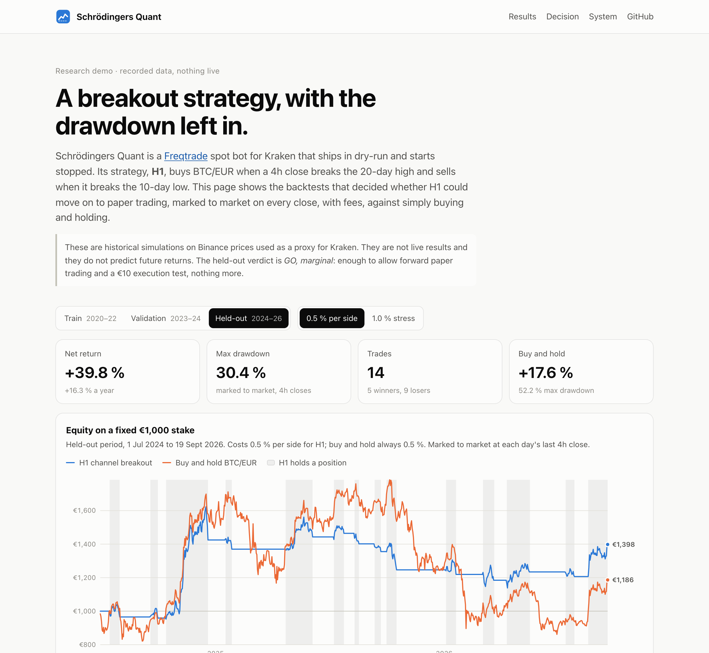
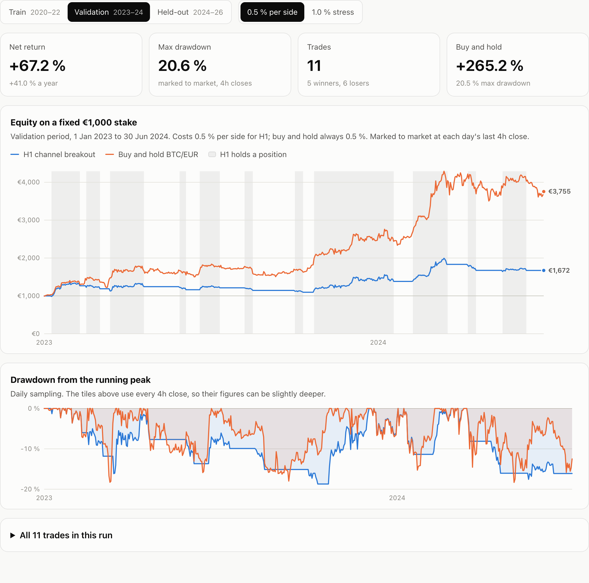
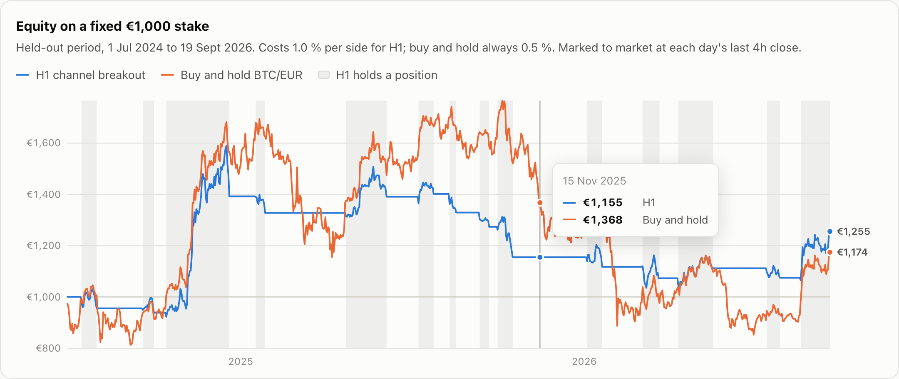
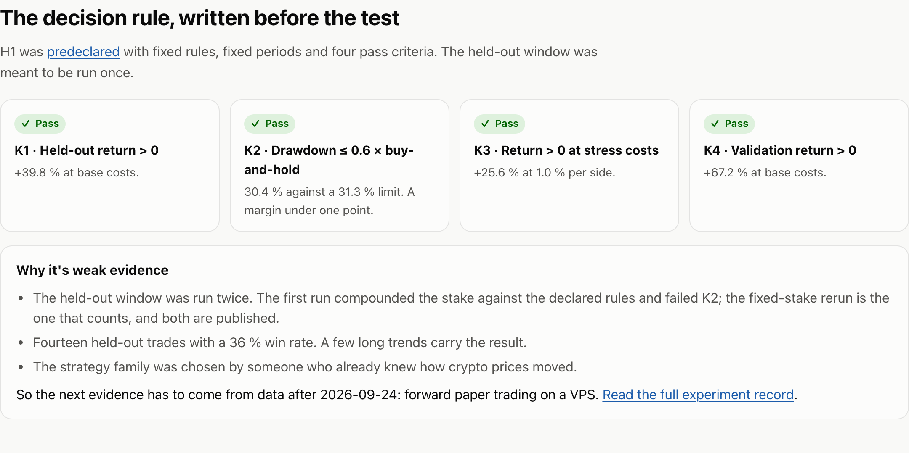
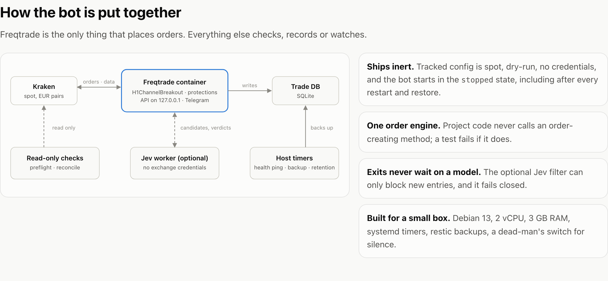
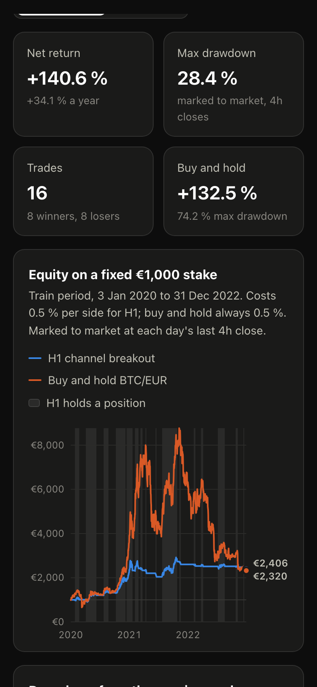

# Schrödingers Quant

[](https://github.com/sebastianspicker/schrodingers-quant/actions/workflows/ci.yml)
[](https://sebastianspicker.github.io/schrodingers-quant/)

The bot is both trading and not trading until you look at the config. Out of
the box, it is **not trading**.

Schrödingers Quant is a cryptocurrency spot trading bot built on
[Freqtrade](https://www.freqtrade.io/), set up for Kraken and a small Debian VPS.
It is meant to run unattended around the clock. The repository contains a
strategy, the research that decided whether to run it, and the
operations around it: health checks, backups, restore, systemd units and
runbooks.

The tracked configuration is dry-run only, has no credentials, and starts the
bot in the `stopped` state. Nothing in this repository places a real order
unless an operator adds keys, applies the live overlay and sends `/start`.

> [!WARNING]
> This is an experiment, not investment advice. The strategy passed its
> predeclared test only by a narrow margin, on simulated fills. Reliable
> operation and positive returns are separate goals, and neither is promised.

## Screenshot tour

The [interactive demo](https://sebastianspicker.github.io/schrodingers-quant/)
shows the recorded backtests of the strategy, H1. It runs in your browser from a
static JSON file. There is no bot or exchange behind it.

### 1. Compare H1 with buy-and-hold

H1 buys BTC/EUR when a 4h close breaks the 20-day high and sells when it breaks
the 10-day low. The demo marks both H1 and buy-and-hold to market on every
close, fees included, on a fixed €1,000 stake. Grey bands show when H1 holds a
position. [Open the held-out run](https://sebastianspicker.github.io/schrodingers-quant/?period=heldout&cost=base).



### 2. See where it lags

In a strong bull market, buy-and-hold wins by a wide margin. H1 exists to cut
drawdowns, not to beat the market in every period.
[Open the validation run](https://sebastianspicker.github.io/schrodingers-quant/?period=validation&cost=base).



### 3. Stress the costs

Switch to 1.0 % per side to see how much fees and slippage matter. Hover over
the chart or use the arrow keys to read the equity on any day.
[Open the stress run](https://sebastianspicker.github.io/schrodingers-quant/?period=heldout&cost=stress).



### 4. Check the decision rule

The four pass criteria were written down before the held-out data was run. The
demo shows each result next to the reasons the evidence is still weak.



### 5. See how the bot is wired

Freqtrade is the only component that places orders. Everything else only
checks, records or watches.



The demo also works on a phone and follows your system's dark mode.



## What's in it

- **A tested strategy.** `H1ChannelBreakout` is a long-only 20/10-day channel
  breakout on BTC/EUR 4h with a −20 % catastrophe stop and Freqtrade protections.
  It was [predeclared](research/hypotheses/H1.md), checked for lookahead bias,
  and evaluated once on held-out data.
  The result is GO, but only just, and the [experiment record](research/experiments/H1/record.md)
  explains why that is weak evidence.
- **Safe defaults.** Spot only, dry-run, no credentials, `initial_state: stopped`.
  A test fails if the tracked config drifts from that, or if project code
  names an order-creating exchange method.
- **Operations for one small VPS.** A health check that pings a dead-man's switch,
  consistent SQLite backups with optional restic, a restore that
  leaves the bot stopped, image pruning, hardened systemd units, and a
  [Debian 13 runbook](ops/README.md) with a
  [14-day soak checklist](ops/soak-checklist.md).
- **Read-only live tooling.** `make preflight` checks whether a stake can
  enter and still exit at the stop after fees, minimums and precision.
  `make reconcile` compares the trade database with Kraken. Neither can place or
  cancel an order.
- **An optional model filter (Jev).** A worker without exchange credentials can
  approve or reject entry candidates. Exits never wait for it, and a missing
  answer blocks the entry. There is no real model provider yet; see [Jev](docs/jev.md).

## Quick start

You need Docker with Compose and [uv](https://docs.astral.sh/uv/).

```sh
git clone https://github.com/sebastianspicker/schrodingers-quant.git
cd schrodingers-quant
uv sync --locked --group dev
make ci        # lint, config validation (base, live and VPS overlays), tests
make up        # dry-run bot; stays "stopped" until started via API or Telegram
make logs
make down
```

`make help` lists every target. Passing checks show that the configuration and
code load and behave as tested. They don't show exchange connectivity, real
fills or profitability.

To run the bot on a server, follow the [Debian 13 runbook](ops/README.md). The
[live pilot runbook](docs/live-pilot.md) covers going live with €10, including
the drills and stop conditions that must come first.

## Adapting it

The strategy and exchange are configuration, not architecture:

- Pairs, stake, exchange and protections live in `config/base.json`. Local and
  secret overlays go in the git-ignored `config/local/`.
- Strategies are plain Freqtrade files in `user_data/strategies/`. They don't
  import project code, so any Freqtrade install can load them.
- Before trusting a new strategy, write a hypothesis in `research/hypotheses/`
  with its rules, periods and pass criteria, then run the held-out period once.
  `research/run.sh` shows how H1 was evaluated.

The live tooling (`sq.live`) and the research data proxy assume Kraken with EUR
pairs. Other exchanges need changes there and a fresh preflight run.

## Repository layout

| Path | Contents |
| --- | --- |
| `compose.yaml` | The pinned Freqtrade image and every service: bot, Jev worker, tools, research, tests |
| `config/` | Freqtrade config layers: `base.json` (dry-run), `live.json` (explicit live overlay), `examples/`, ignored `local/` |
| `user_data/strategies/` | `H1ChannelBreakout` (frozen), `H1JevShadow` (optional model filter) |
| `src/sq/` | Project package: config validation, read-only live tools, Jev worker and evaluation, research tools |
| `research/` | Hypotheses, research configs, experiment records, `run.sh` |
| `ops/` | Host side: health ping, backup and restore, retention, systemd units, runbooks |
| `pages/` | The GitHub Pages demo and its screenshots |
| `tests/` | pytest suite, run inside the pinned Freqtrade image |
| `docs/` | [Status](docs/status.md), [architecture](docs/architecture.md), [ADRs](docs/adr/README.md), [operations](docs/operations.md), [live pilot](docs/live-pilot.md), [Jev](docs/jev.md) |

Research, backtests and model work run on a development machine, never on the
VPS.

## Project status

Dry-run only. Nothing has been deployed, funded or traded live. The next
step is a 14-day soak on a VPS, which also serves as H1's forward paper test.
See [status](docs/status.md) for what has been verified and what hasn't.

## Contributing and security

Issues and pull requests are welcome; see [CONTRIBUTING](CONTRIBUTING.md).
Report vulnerabilities privately as described in [SECURITY](SECURITY.md).
Never paste API keys, account exports or trade databases into an issue.

## License

[MIT](LICENSE)
